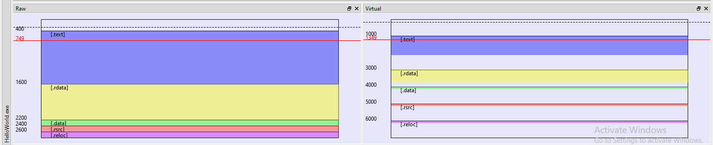
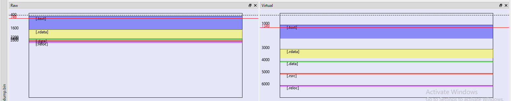
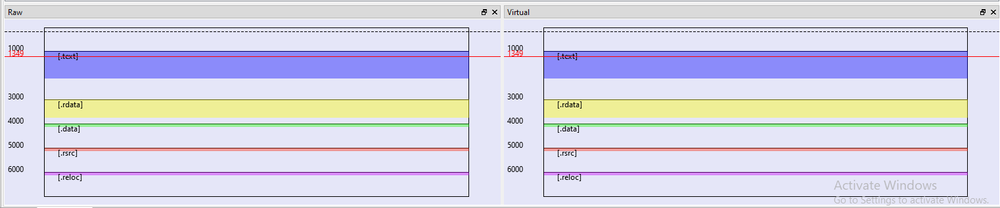
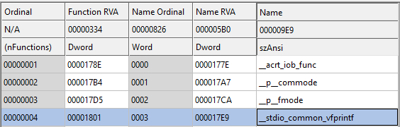

# Playing with PE Files, Packers and Qiling Framework

## Introduction

Hi there! I'm launching a new version of the blog... and needed some good excuse for this, so here we have a new blog post!. This time I decided to take a look at how packers work and for that I had to learn quite a few things about the PE file format, how windows load files and spend a lot of time banging my head against the keyboard.

The idea for this blog post is to describe two scenarios that I wanted to explore and what I learned along the way:

1) Execute a simple x86 file in Qiling Framework, dump it from memory and being able to run it again.
2) Perform the same task that in the first scenario, but this time, packing the file previously. In this case I used Qiling to unpack the file.

_Note: So far I was not able to manually reconstruct the IAT from the dump, that, I hope, will be material for other post._

Some notes:
    
- This will be basic stuff but it could help people like me that do not know a lot about these topics.
- I'm not an expert. I could have come up with incorrect assumption.
- I used UPX as packer because its simplicity and ease to unpack.

This blog post is based on the work of a lot of people, but specially [Ricardo Narvaja's](http://ricardonarvaja.info/) tutorial series "Introducción al reversing con IDA Pro desde cero" [chapter 14](http://ricardonarvaja.info/WEB/IDA%20DESDE%20CERO/CURSO%20DE%20IDA%20TUTES/14-INTRODUCCION%20AL%20REVERSING%20CON%20IDA%20PRO%20DESDE%20CERO.docx) and [chapter 15](http://ricardonarvaja.info/WEB/IDA%20DESDE%20CERO/CURSO%20DE%20IDA%20TUTES/15-INTRODUCCION%20AL%20REVERSING%20CON%20IDA%20PRO%20DESDE%20CERO.docx).

## First scenario. Running a binary in Qiling, dumping it from memory and running it again

Before going with the packed example, I wanted to start with what I though was an easy task &mdash; running a simple binary, stopping the execution at the entry point and dumping the binary from memory to a file hoping I could execute it again &mdash; Well... it wasn't that easy.

To start I compiled a simple "Hello World" application for x86 in Visual Studio 2019. I tried to keep compilation as simple as possible and ended up with the following command line:

~~~
/permissive- /GS- /Qpar- /analyze- /W3 /Gy- /Zc:wchar_t /Gm- /Od /Ob0 /sdl- /Fd"Debug\vc142.pdb" /Zc:inline /fp:precise /D "WIN32" /D "_DEBUG" /D "_CONSOLE" /errorReport:prompt /WX- /Zc:forScope /Gd /Oy- /MD /FC /Fa"Debug\" /nologo /Fo"Debug\" /Fp"Debug\HelloWorld.pch" /diagnostics:column 
~~~

To run the program in Qiling I used the following code:

<html>

</html>

This code gives you a Python shell and stops execution once the emulation reach the Program Entry Point. This allowed me to play and explore what options I had to dump the memory, and later, to troubleshot issues.

Once the execution reached the entry point I used the following Qiling capabilities to dump the memory:

1) `ql.mem.show_mapinfo()` to view what memory range I had to dump.

~~~
(Pdb) ql.mem.show_mapinfo()
...
[=] [memory.py:139]	[+] 00400000 - 00407000 - rwx    [PE] (/../bin/x86/HelloWorld.exe)
...
~~~

In this case we can see that the binary was loaded at `0x00400000` and has a size of `0x7000`

2) `ql.mem.read(0x00400000, 0x7000)`

~~~Python
(Pdb) f = open('memory_dump.bin', 'wb')
(Pdb) f.write(ql.mem.read(0x00400000, 0x7000))
28672
(Pdb) f.close()
~~~

After these commands we have a memory dump with our binary exactly as it was mapped in memory. If we try to run this binary we won't succeed because binaries have different properties when they are loaded and when they are written in disk. Our dump kept the "in memory" properties and was saved to the disk. When the loader reads these properties back, things don't add up. Let's explore these differences and check what we can do to fix it.

### Virtual Size, Raw Size, Virtual Offset and Raw Offset

To analyze the original file and the dumped one I used [PEBear](https://hshrzd.wordpress.com/pe-bear/) a really cool tool.

In the following image we can see a visual representation of the "HelloWorld.exe" binary in its two versions, RAW (as it is in the disk) and Virtual (When loaded in memory):

<html>

</html>

As you can see sections have different size, and maybe you already see the problem. Let's see the same image for our dump:

<html>

</html>

This don't look good. As we can see, sections in both representations have the same size (This makes sense as we dumped this from memory. In this case we never had the Raw representation). An interesting question is ... And what's the impact of this? Well, based on my limited understanding I guess that there is a lot of offsets that are calculated based on these properties, and of course, are broken. The most important thing for us is that the `Import Table` &mdash; A table used by the binary, that specifies what functions it uses and instructs the loader in which external DLL's it should go and search them &mdash; does not work.

There are wonderful blog post and books about these topics that explain this in a better way than me. I read the following ones:

- [Practical binary analysis](https://practicalbinaryanalysis.com/), Part I. Chapter 3.
- [Understanding RVAs and Import tables](http://www.sunshine2k.de/reversing/tuts/tut_rvait.htm)

In Ricardo's tutorial he explained how to fix this using PE Editor, specifically using a magic button "RS=VS & RO=VO" that worked like a charm, but I wanted to understand what I was doing.

What we need to do is to "align" these sections, and the easiest way is to match the values for the "virtual" representation on the "raw" representation, and that's what the magic button does. But we'll do it using another cool project, [pefile](https://github.com/erocarrera/pefile), a Python library. The code I used it's pretty simple:

~~~Python
import pefile

binary = pefile.PE('<path_to_dump>')

for section in binary.sections:
    section.PointerToRawData = section.VirtualAddress

binary.write('dump_fix.exe')
~~~

This code retrieves every section and sets its Raw Data offset to the Virtual address. It writes the result to a new file called `dump_fix.exe`.

Let's analyze it in PEBear:

<html>

</html>

As we can see sections are aligned and the dumped binary works!. Now it's time to play with the compressed version.

## Second scenario. Unpacking a packed binary with Qiling Framework

Following Ricardo's post I decided to implement the technique that he explained using Qiling. The main idea was to automatically dump the binary once it was decompressed in memory.

For this task I explored several options with different goals in mind:

- If we suppose to know the original entry point (OEP) we can just put a hook and stop the program when that address is reached. This of course won't be the case if we don't have access to the unpacked binary.

- If we don't have access to the OEP, what I ended up doing was to hook a block of code to tell Qiling to stop the execution when that block was executed. What block is the question then...? The one that the packer reserved to write the program once it starts unpacking it. For this I used the following idea:

1) I checked where that section started and ended:

~~~
objdump -h HelloWorldCompressed.exe 

HelloWorldCompressed.exe:     file format pei-i386

Sections:
Idx Name          Size      VMA       LMA       File off  Algn
  0 UPX0          00006000  00401000  00401000  00000400  2**2
                  CONTENTS, ALLOC, CODE

~~~

2) We know that starts at `0x401000` and ends at `0x407000`
3) With this information we can used the following code:

~~~Python
def dump_packed_program(ql):
    logging.info('Dumping program from memory...')
    with open('dump_file_compressed.bin', 'wb') as dump_file:
        dump_file.write(ql.mem.read(UPX0_START, DUMP_SIZE))
    logging.info('File dumped to: dump_file_compressed.bin')
    ql.emu_stop()

...
def trace_code(ql, address, size):
    try:
        buf = ql.mem.read(address, size)
        for i in md.disasm(buf, address):
            print(":: 0x%x:\t%s\t%s" %(i.address, i.mnemonic, i.op_str))
    except:
        pass
...
ql.hook_block(trace_code, begin=0x401000, end=0x00407000)
#ql.hook_block(dump_packed_program, begin=0x401000, end=0x00407000)
...
~~~

The code snippet above shows two  different options. It can dump the program to disk or to trace its execution instruction by instruction as shown below:

<html>

</html>

This is a very basic approach and only will work with small binaries. But on the bright side allows us to se which API calls are being made. As you can see after a `call dword ptr [address]` we see the name of the API (thanks Qiling!).

## Some notes about what did not work

### Trying to dump the program too early

At the beginning I tried to dump the program before reaching the OEP, something like this:

~~~Python
...
ql.hook_code(dump_packed_program, begin=UPX0_START, end=UPX0_START+DUMP_SIZE)
UPX0_START = 0x400000
DUMP_SIZE = 0xa000
...
~~~

This did not work. I guess that the cause was that the code that unpacks the original program did not run. Before I explained a way to solve this.

## Bonus section: How to find API addresses in the packed program dump

This section is more a reminder for myself than an actually section :P. But it may be useful for someone else.

The problem that I was facing was: How I can find what's the actual address of an API, for example, `__stdio_common_vfprintf` in the packed binary's dump.

What I did was:

1) Modify Qiling and make it print the IAT dictionary that it builds while loading a binary and load the unpacked binary. I found the following information:

~~~
Import name: b'__stdio_common_vfprintf', Address from IAT: 0x10286801, written to: 0x4030c4
~~~

2) Take a look at what address the library (dll) exporting my API was being loaded 

[=] [memory.py:139]	[+] 10285000 - 10289000 - rwx    api-ms-win-crt-stdio-l1-1-0.dll (/api-ms-win-crt-stdio-l1-1-0.dll)

3) Subtract the address found in the IAT to the base address

0x10286801 - 0x10285000 = 0x1801

4) Look at what address the library was loaded when the packed binary was loaded:

[=] [memory.py:139]	[+] 10280000 - 10284000 - rwx    api-ms-win-crt-stdio-l1-1-0.dll (/api-ms-win-crt-stdio-l1-1-0.dll)

4) Add the offset from step 3 to the base address of the library --> hex(0x10280000+0x1801) = 0x10281801

5) Search for the value from step 4 in the dump (in Little Endian!): 01 18 28 10 --> found address 0x4030c4

6) To be sure that this was correct I patched the binary at address `0x4030c4` with `b'\x00\x00\x00\x00'` and it crashed before printing the Hello world message. _Note: The patching must be done after the program was unpacked. This means, after it reached the OEP._

All of this could have been be done in an easier way, just looking at the exported functions from `api-ms-win-crt-stdio-l1-1-0.dll`. But I learned it in the hard way :P.

<html>

</html>

